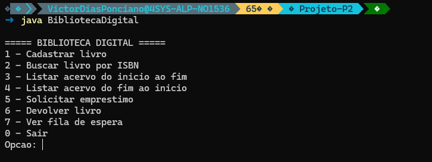
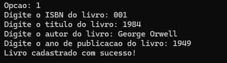
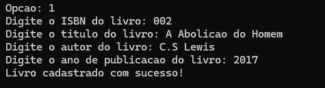
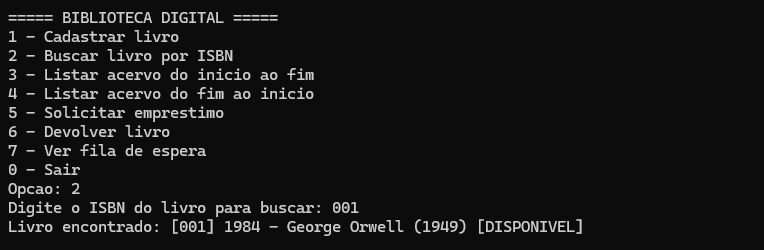
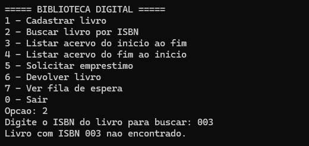
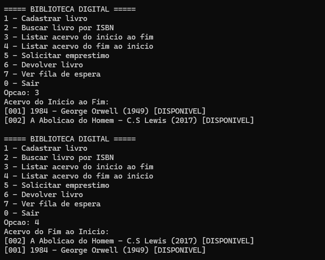
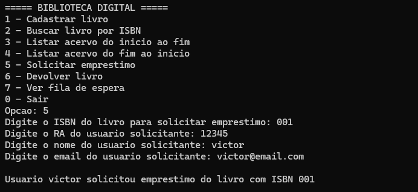
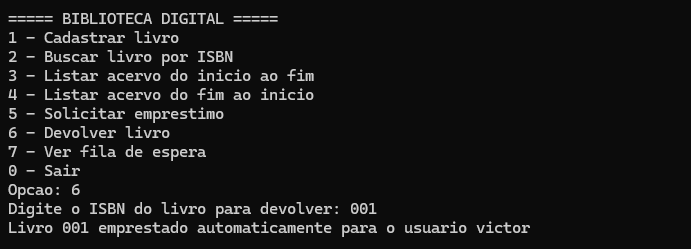
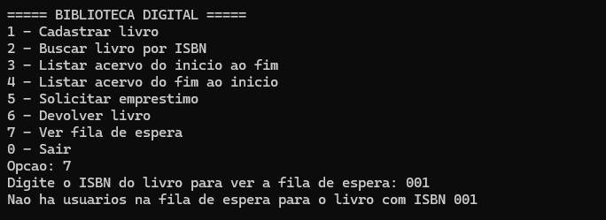
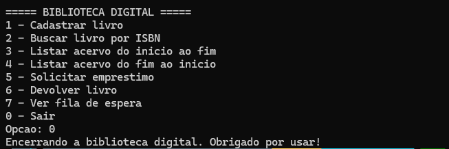

# 📚 Biblioteca Digital

> 👨‍🎓 **Aluno:** Victor Ponciano - https://github.com/VictorPonciano1

> 🏫 **Disciplina:** Estrutura de Dados

> 👩‍🏫 **Professora:** Andréia Machion

## 📖 Descrição do Projeto

Este projeto foi desenvolvido para a disciplina de Estrutura de Dados e tem como objetivo aplicar conceitos de estruturas lineares e não lineares por meio da implementação de um sistema de Biblioteca Digital.

O sistema permite o gerenciamento de livros, usuários, empréstimos e filas de espera, utilizando diferentes estruturas de dados estudadas em aula.

O projeto é uma continuação do Projeto I, que utilizava Vetor Dinâmico e Pilha. Nesta nova etapa são introduzidos conceitos de:

- 🔗 Lista Duplamente Encadeada
- 🚶‍♂️  Fila Genérica
- #️⃣ Tabela Hash
- 🧩 Classes Genéricas em Java

### ⚠ Problema Inicial

Uma biblioteca digital precisa de três mecanismos distintos para funcionar bem: 
- Um acervo navegável: lista dos livros disponíveis que permita inserir e remover do 
início ou do fim, e percorrer nos dois sentidos (por exemplo, avançar e voltar páginas 
em uma interface de catálogo). 
- Uma fila de espera: quando um livro está emprestado, os interessados entram em 
uma fila. O primeiro a solicitar é o primeiro a ser atendido quando o livro for devolvido 
(FIFO). 
- Um catálogo indexado: para que o sistema localize qualquer livro instantaneamente 
pelo seu ISBN, sem precisar percorrer o acervo inteiro.

### 📁 Estrutura do Projeto

O projeto é dividido em três etapas incrementais, cada uma introduzindo uma nova estrutura 
sobre as classes de domínio compartilhadas. 
1. **Etapa 1:** Classes de Domínio e Lista Duplamente Encadeada.
```
[-] 📕 Livro
[-] 👨 Usuario
[-] ➰ NoDuplo
[-] 📄 ListaDupla
```
2. **Etapa 2:** Fila Genérica e Gestão de Empréstimos.
```
[-] ➰ No<T>
[-] 👫 Fila<T>
[-] 💲 GestorEmprestimos
```
3. **Etapa 3:** Tabela Hash e Catálogo Indexado.
```
[-] 🚪 Entrada<K,V>
[-] 📁 NossoHash<K,V>
[-] 📝 Catalogo
```

## 🎯 Objetivos

Desenvolver um sistema capaz de:

- 📚 Cadastrar livros em um acervo
- 🔍 Realizar buscas por ISBN
- 🔄 Navegar pelo acervo nos dois sentidos
- 📝 Gerenciar empréstimos de livros
- 👥 Controlar filas de espera para livros indisponíveis
- ⚡ Realizar buscas rápidas utilizando tabela hash

## 🧩 Arquitetura do Projeto (arquivos principais)

As classes principais do projeto se conectam para formar três camadas de funcionamento: domínio, estruturas de dados e aplicação.

### 1) Domínio

- **Livro.java**: representa cada livro (ISBN, título, autor, ano e disponibilidade).
- **Usuario.java**: representa o solicitante de empréstimo (matrícula, nome e email).

### 2) Estruturas de Dados

- **NoDuplo.java** e **ListaDupla.java**: acervo navegável em dois sentidos.
- **No.java** e **Fila.java**: fila de espera genérica para solicitações de empréstimo.
- **Entrada.java** e **NossoHash.java**: tabela hash para indexação eficiente por chave.

### 3) Regras de Aplicação

- **Catalogo.java**: usa a hash para cadastrar e buscar livros por ISBN.
- **GestorEmprestimos.java**: controla filas por ISBN e realiza empréstimo automático após devolução.
- **BibliotecaDigital.java**: reúne tudo em um menu interativo no terminal.

> ⚠ **IMPORTANTE: O teste pedido da Etapa 1 está presente na pasta `Fotos-Testes/` que faz parte deste repositório.**

## ⚙ Como o sistema funciona

Fluxo geral de execução:

1. O usuário inicia a aplicação em BibliotecaDigital.java.
2. O menu principal recebe a opção digitada.
3. Cada opção chama uma regra específica:
	- Cadastro: cria Livro, grava no Catalogo e adiciona no ListaDupla.
	- Busca por ISBN: consulta direta no Catalogo (hash).
	- Listagem: percorre ListaDupla do início ao fim ou do fim ao início.
	- Solicitação de empréstimo: cria Usuario e enfileira em GestorEmprestimos.
	- Devolução: remove da fila e empresta automaticamente ao próximo usuário.
4. O ciclo repete até a opção de saída.

## 🖼 Demonstração com as imagens da pasta Fotos-Testes

### Menu inicial da aplicação



### Cadastro de livros

Primeiro cadastro:



Segundo cadastro:



### Busca por ISBN

Busca com sucesso:



Busca sem resultado:



### Listagem do acervo nos dois sentidos



### Solicitação de empréstimo



### Devolução com empréstimo automático para fila de espera



### Visualização da fila de espera por ISBN



### Encerramento da aplicação



